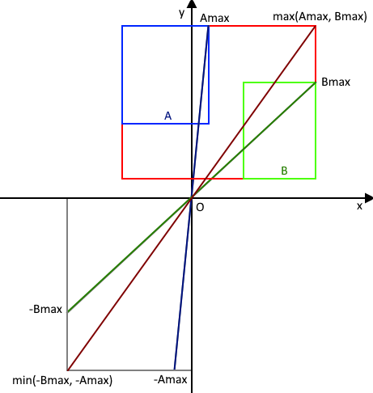
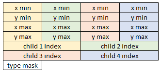
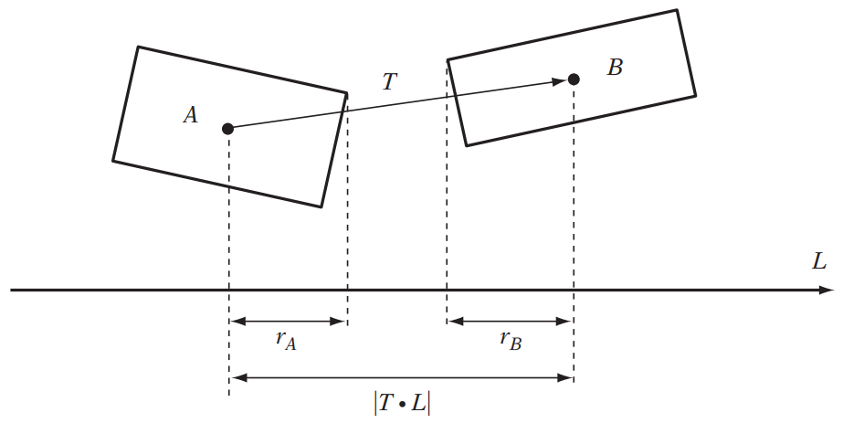
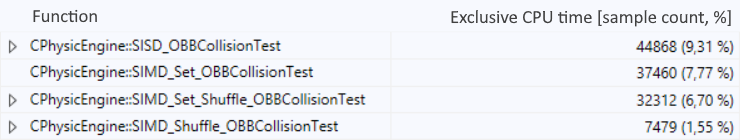

# SIMD Collision Detection

The project's goal was to use **SIMD** to speed up collision detection by using CPU parallelization.

It was developed in two weeks in a group of two people. 

## **Table of Contents**

+ [How to launch](#How-to-Launch)
+ [Controls](#Controls)
+ [Interesting Code](#Interesting-Code)
+ [Technical Document](#Technical-Document)
  + [Introductuction](#Introduction)
  + [Broad Phase](#Broad-Phase)
  + [Narrow Phase](#Narrow-Phase)
  + [Conclusion](#Conclusion)
  + [Going Further](#Going-Further)
  + [References](#References)

 

## **How to Launch**

+ ### Run Executable

> Extract "SIMD_CollisionDetection_Binary.rar" archive and run "LuxUmbra.exe"

+ ### Compile the project

> Open "SIMD_CollisionDetection.sln" solution file. You may need to retarget the project. Compile and run the project.

 

## **Controls**

+ F1: reset current scene
+ F2: go to previous scene
+ F3: go to next scene  
+ F4: show debug info, also toggle BVH4 display
+ Left Click: move polygon
+ Right Click: rotate polygon

 

## **Interesting Code**

Interesting code related to collision detection and SIMD can be found in the following places:

<ins>*General*</ins> 
PhysicEngine.cpp -> CPhysicEngine::Step
 
AABB.h
 
AABB.cpp

<ins>*BVH Construction*</ins> 
PhysicEngine.cpp -> CPhysicEngine::BuildAABBTree, CPhysicEngine::BVH2Recurse, CPhysicEngine::BVH2ToBVH4

<ins>*Broad Phase*</ins> 
BroadPhaseAABBTree.cpp

<ins>Narrow Phase</ins> 
PhysicEngine.cpp -> CPhysicEngine::SIMD_Shuffle_OBBCollisionTest

 

## **Technical Document**

### **Introduction**

For this project, we decided to work from the base project we had last year when we were doing collision detection on polygons in two dimensions. This base has rendering, a scene management and some inputs already setup, so we did not lose time doing that ourselves. However, we had to refactor already existent code to make it more SIMD friendly, using structure of array layout (SoA) in a number of places.

The base project can generate convex polygons with any number of vertices. We did not think we had the time to implement a working SIMD collision detection for any polygon, like the separating axis theorem (SAT) or the GJK algorithm, we decided to work only with oriented bounding boxes (OBB).

Our broad phase begins with building a bounding volume hierarchy (BVH) from the axis-aligned bounding box (AABB) that surrounds every polygon in the scene. Then we test every polygon’s AABB against that BVH to find potential collisions. Pairs of potentially colliding polygons are then passed to the narrow phase. Consequently, the narrow phase consists of an OBB-OBB overlap test.

We did not take the time to adapt the math structures that came with the base project because we practically did not work with them, using the __m128 type or float pointers where we used SoA layout.

 

### **Broad Phase**

Every polygon is bound by an AABB. We chose a min/max representation for our AABBs over center/half-extent or corner/extent because it is simpler to test in SIMD. Also, for AABBs in world space, we store the opposite of the max value so that we can build the surrounding AABB of two other AABBs using only one min SSE instruction.

<ins>**Figure 1:**</ins> equivalence between max of maximums and min of -maximums

 
We have chosen a method for the construction of world space AABBs that works for any polygon because at the time we had not yet decided to work only with OBBs. The first step is to create an AABB in local space for the polygon when it is generated. Then we transform the vertices of this local AABB in the world space, making it an OBB, and build a new AABB that surrounds it. In comparison with building the world space AABB around the polygon vertices transformed into world space, the only drawback of this method is that the resulting bounding volume is not as tight as possible around the geometry. However, it has two important benefits. First, AABBs have a fixed number of vertices that is a multiple of 4 and that is very good for SIMD, a guarantee we don’t have with generic polygons. The second benefit is that the SIMD ‘unfriendly’ code of building the local AABB around a random number of points is executed only once.

After computing all AABBs in world space, we build a two-way BVH out of them. At each step we sort all AABBs along the x and y axes based on their center position. We then split the sorted AABBs in two halves and evaluate the surface area heuristic (SAH) cost for each group. The axis on which the sum of SAH for both sides is minimum will be chosen as the separating axis for this step. We create a BVH node for each half and then recurse by doing the same step on each half. The recursion stops on a list of 1 AABB, where it creates a leaf.

This two-way BVH is then used to build a four-way BVH, using a top-down algorithm that merges the nodes of the two-way BVH every other level to get four children per node.

The resulting BVH uses a SoA layout in its nodes, with the AABBs components (x min, x max, y min and y max) packed 4 by 4 inside a PackedAABB structure.

<ins>**Figure 2:**</ins> data layout for the 4-way BVH node

The final step of the broad phase is testing each polygon’s world AABB against the BVH for potential collision. The polygon’s AABB is expanded into a PackedAABB to be tested against the PackedAABB inside the BVH nodes, therefore it is tested against 4 AABBs at a time.

 

### **Narrow Phase**

At first, we tried to translate the SAT algorithm into SIMD but we quickly realised that it was too ambitious with the time we had for the project. We decided then to only work with OBBs and implement an OBB against OBB overlap test. We translated the algorithm described in Real time Collision Detection by Christer Ericson with a few changes. This test is a version of the SAT algorithm that has been optimized using the properties of rectangles. The algorithm computes and compares projections on the vector base of each polygon. We sum the half projection of the polygons on each axis and compare it to the projection of the translation between their centers. If the projected translation is greater than the sum of the projected polygons, then the axis is separating, and we conclude that the OBBs are not overlapping. If no axis provides such result, then the OBBs are overlapping.

<ins>**Figure 3:**</ins> an example of SAT test with OBBs

Unlike Ericson’s version of the algorithm, we operate in world space instead of the space of one of the polygons and project two extent vectors ((x, y) and (x, -y)) per polygon on the axes of the other to get the maximum projection for the polygon.

 

### **Conclusion**

We concentrated our profiling efforts on the narrow phase algorithm. For testing purposes, we used the BroadPhaseBrut class that comes with the base project and basically does not do a broad phase: it returns every possible pair of polygons out of all the polygons in the scene. We ran the tests with 250 polygons.

Our naive SIMD translation of the algorithm ran just a bit faster than the SISD version from Real Time Collision Detection (it is actually optimized into SIMD instructions by the compiler but written as SISD code in C++). We further improved performances by reducing the number of loads to xmm registers and using the shuffle intrinsic to reorganize the data for computation.

<ins>**Figure 4:**</ins> profiling results for the OBB-OBB overlap test

The SISD function is the implementation without SIMD from Real Time Collision Detection. The SIMD_Set is our first implementation with explicit SIMD that uses a lot of calls to the set intrinsic. SIMD_Set_Shuffle is the version where we reduced the number of calls to the set intrinsic. SIMD_Shuffle is the version where the calls to the set intrinsic are done outside the function, isolating only the shuffles and overlap test. We could not find the time to implement such a complex algorithm with a ‘real’ SIMD approach (testing 2 or 4 pairs at a time).

 

### **Going Further**

+ In his 2018 GDC talk, Earl Hammon describes how he makes a four-way BVH node fit into a single cache line by packing his floating values into 16 bits integers. This is something we investigated very rapidly at the beginning, but we did not find a solution.
+ Regarding our OBB-OBB overlap test, we would have liked to spend some time looking at the generated assembly code for the SISD version to understand how it is compiled into SIMD instructions and see if it helps us further improving our algorithm.
+ Our broad phase tests an AABB against 4 AABBS, but our narrow phase operates on a pair of polygons. We could improve that by grouping potentially colliding and testing multiple in parallel.
+ More primitive types and tests between different types.
+ Converting more of the code base to the SoA layout.
+ Detecting and adapting to available instruction set extensions (for example an 8-way BVH with AVX registers).

 

### **References**

### *Broad Phase*

+ Earl Hammon at GDC 2018: [Extreme SIMD: Optimized Collision Detection in Titanfall](https://www.gdcvault.com/play/1025126/Extreme-SIMD-Optimized-Collision-Detection) for BVH2 construction with SAH and BVH4 node layout
+ [Peter Shirley: Ray Tracing - The Next Week](https://www.realtimerendering.com/raytracing/Ray%20Tracing_%20The%20Next%20Week.pdf) for BVH2 construction
+ [Intel Embree renderer source](https://github.com/NicolasBun/Embree/blob/master/EmbPT/rtcore/bvh2/bvh2_to_bvh4.cpp) for BVH4 construction from a BVH2
+ [Fabian Giesen blog](https://fgiesen.wordpress.com/2013/01/14/min-max-under-negation-and-an-aabb-trick/) for a trick to get surrounding AABB for 2 AABBs with one SSE instruction

### *SIMD*

+ Andreas Fredriksson at GDC 2015: [SIMD at Insomniac Games (How we do the shuffle)](https://deplinenoise.files.wordpress.com/2015/03/gdc2015_afredriksson_simd.pdf) for general SIMD good practice and tips

### *Physic*

+ Christer Ericson - Real-Time Collision Detection
+ Chapter 4: Bounding Volumes for the OBB-OBB overlap test
+ Chapter 6: Bounding Volume Hierarchies for the BVH construction
